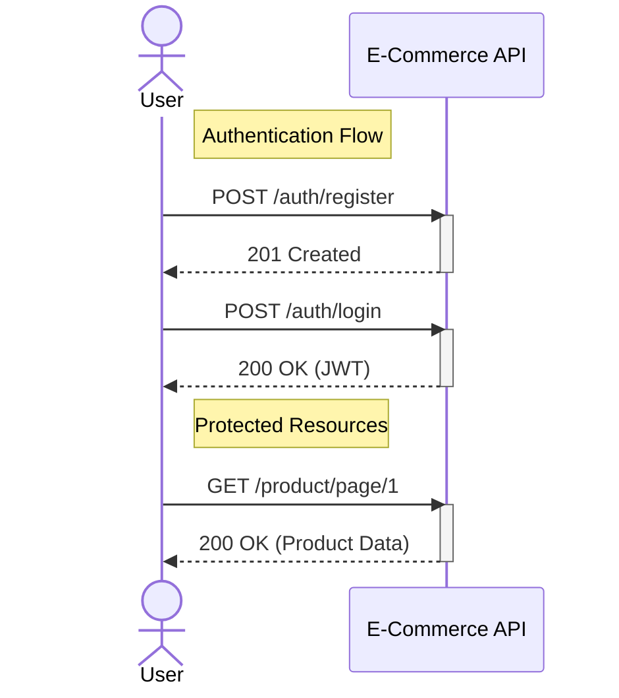

# E-Commerce API Documentation

## Table of Contents
- [Overview](#Overview)
- [API Endpoints](#Api-endpoints)
- [Getting Started](#Getting-started)
- [Deployment](#Docker-setup)

## Overview

This is a comprehensive backend API for an e-commerce platform built with Express.js and TypeScript. The API provides endpoints for authentication, product management, shopping cart operations, order processing, payment handling, and reviews.

## Technology Stack

- **Backend**: Express.js
- **Language**: TypeScript
- **Database**: PostgreSQL with ORM Prisma
- **Authentication**: JWT (JSON Web Tokens), OAuth (Google)
- **Security**: Helmet, XSS protection, CSRF validation, Rate limiting
- **Payment Processing**: Stripe
- **Caching**: Redis (For product caching & rate limiting)
- **Testing**: Jest
- **Architecture**: MVC pattern with Service layer

## Security Features

- **Helmet**: Security headers to protect against common vulnerabilities
- **XSS Protection**: Prevents cross-site scripting attacks
- **CORS Configuration**: Restricts origins to trusted domains
- **CSRF Protection**: Token validation on sensitive operations
- **Rate Limiting**: Protection against brute force and DoS attacks
- **Content Security Policy**: Restricts sources for scripts, images, and resources
- **Permission-Based Access Control**: Role-based permissions for API operations

## Authentication

- **Local Authentication**: Email/password registration and login with verification
- **OAuth Authentication**: Google OAuth integration
- **Two-Factor Authentication (2FA)**: Email-based 2FA with multiple email support
- **Session Management**: Secure token refresh and logout functionality

## API Endpoints

### Auth API

| Endpoint | Method | Description | Auth Required | CSRF Required |
|----------|--------|-------------|--------------|---------------|
| `/auth/register` | POST | Register user | No | No |
| `/auth/login` | POST | Login | No | No |
| `/auth/verify-email` | GET | Verify email | No | No |
| `/auth/reset-password` | POST | Reset password | No | No |
| `/auth/forgot-password` | POST | Request reset | No | No |
| `/auth/logout` | POST | Logout | Yes | Yes |
| `/auth/refresh` | POST | Refresh token | No | No |
| `/auth/2fa/email/request` | POST | Request 2FA code | Yes | Yes |
| `/auth/2fa/email/verify` | POST | Verify 2FA code | Yes | Yes |
| `/auth/2fa/addEmail` | POST | Add 2FA email | Yes | Yes |
| `/auth/google` | GET | Google OAuth | No | No |
| `/auth/google/redirect` | GET | OAuth callback | No | No |

### Product API

| Endpoint | Method | Description | Auth Required | Permission |
|----------|--------|-------------|--------------|------------|
| `/product/page/:page` | GET | Get products | No | None |
| `/product/search` | POST | Search products | No | None |
| `/product/` | POST | Add product | Yes | `Product:create` |
| `/product/:id` | PATCH | Update product | Yes | `Product:update` |
| `/product/:id` | DELETE | Delete product | Yes | `Product:delete` |
| `/product/hide/:id` | PATCH | Hide product | Yes | `Product:hide` |
| `/product/restore/:id` | PATCH | Restore product | Yes | `Product:update` |
| `/product/hidden` | GET | Get hidden products | Yes | `Product:hide` |
| `/product/tags` | GET | Get tags | Yes | `Product:view` |
| `/product/categories` | GET | Get categories | Yes | `Product:view` |

### Cart API

| Endpoint | Method | Description | Auth Required | Permission |
|----------|--------|-------------|--------------|------------|
| `/cart/` | GET | Get cart items | Yes | `Cart:view` |
| `/cart/:productId` | DELETE | Remove item | Yes | `Cart:delete` |
| `/cart/` | DELETE | Clear cart | Yes | `Cart:delete` |
| `/cart/` | POST | Add item | Yes | `Cart:create` |
| `/cart/` | PATCH | Update cart | Yes | `Cart:update` |

### Order API

| Endpoint | Method | Description | Auth Required | Permission |
|----------|--------|-------------|--------------|------------|
| `/orders/` | POST | Create order | Yes | `Order:create` |
| `/orders/` | GET | Get all orders | Yes | `Order:view` |
| `/orders/user` | GET | Get user orders | Yes | `Order:view` |
| `/orders/:orderId` | GET | Get order | Yes | `Order:view` |
| `/orders/:orderId` | DELETE | Delete order | Yes | `Order:delete` |
| `/orders/:orderId/status` | PATCH | Update status | Yes | `Order:update` |

### Payment API

| Endpoint | Method | Description | Auth Required | Permission |
|----------|--------|-------------|--------------|------------|
| `/payment/` | GET | Get Stripe key | Yes | None |
| `/payment/webhook` | POST | Stripe webhook | No | None |
| `/payment/` | POST | Process payment | Yes | `Payment:view` |

### Review API

| Endpoint | Method | Description | Auth Required | Permission |
|----------|--------|-------------|--------------|------------|
| `/review/:productId` | GET | Get reviews | Yes | `Review:view` |
| `/review/:productId` | DELETE | Delete review | Yes | `Review:delete` |
| `/review/` | POST | Add review | Yes | `Review:create` |
| `/review/:productId` | PATCH | Update review | Yes | `Review:update` |

## Services Layer

The application implements a service layer pattern to separate business logic:

- **Cart-Service**: Shopping cart operations
- **Order-Service**: Order processing and management
- **Product-Service**: Product data management
- **Redis-Service**: Caching operations
- **Review-Service**: Product reviews management
- **User-Service**: User-related operations

## Middleware Components

- **Auth-Middleware**: Authentication verification
- **Check-Permission**: Role-based permission handling
- **CSRF.validation**: Protection against CSRF attacks
- **Error-handler**: Central error handling
- **limiter**: Rate limiting implementation

## Getting Started

### Prerequisites

- Node.js v18+
- PostgreSQL
- Redis
- Docker (optional)

1. Clone the repository:
   git clone https://github.com/salahqr/ecommerce-web-backend.git
   cd ecommerce-api

2. Install dependencies:
    npm install

3. Set up environment variables (create `.env` file):
    PORT
    NODE_ENV
    clientID
    clientSecret
    Access_TOKEN_SECRET
    REFRESH_TOKEN_SECRET
    FORGOT_TOKEN_SECRET
    MyEmail
    MyEmailPassword,
    STRIPE_SEECRET_KEY
    STRIPE_Publishable_KEY    
    STRIPE_WEBHOOK_SECRET
    LOCAL_DATABASE_URL
    DB_PASSWORD
    DB_NAME
    REDIS_URL

4. Database setup:
    npx prisma migrate dev
    npx prisma generate

5. Run the application:
    npm run dev

## Docker Setup
    docker-compose up --build



## Running Tests
Run unit tests using Jest:
```bash
npm run test
